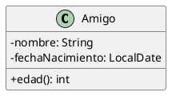

# ¿Mayor o menor?

Crea una aplicación que permita comparar la edad de tus amigos.

Para ello, implementaremos la clase `Amigo`:



El programa mostrará un menú como el siguiente:

```text
1. Nuevo amigo
2. Listado de amigos y edad de cada uno
3. ¿Mayor o menor?
4. Salir
```

El programa principal pedirá al usuario todos los datos necesarios y creará los objetos que hagan falta.

En el caso 3, permitirá elegir dos amigos y mostrará quien es el mayor de los dos.

## Requisitos

- Para almacenar los amigos se utilizará una lista y, al añadir un nuevo amigo, se verificará que no esté repetido.
- La clase `Amigo` sobrecargará el método `equals()` para que considere que dos amigos son iguales si coincide nombre y
  fecha de nacimiento.
- Para comparar dos amigos entre sí se implementará el interfaz `Comparable<>` de modo que compare los objetos en
  función de la fecha de nacimiento.

## Sugerencias

Para comprobar si un elemento ya existe en una lista se puede
utilizar [el método `contains()`](https://docs.oracle.com/javase/8/docs/api/java/util/List.html#contains-java.lang.Object-)
.

## Restricciones

- No hay límite en el número de amigos que podemos almacenar.
- El programa no termina hasta que se elija la opción de salir.
- Es obligatorio tratar las posibles excepciones de forma adecuada.
